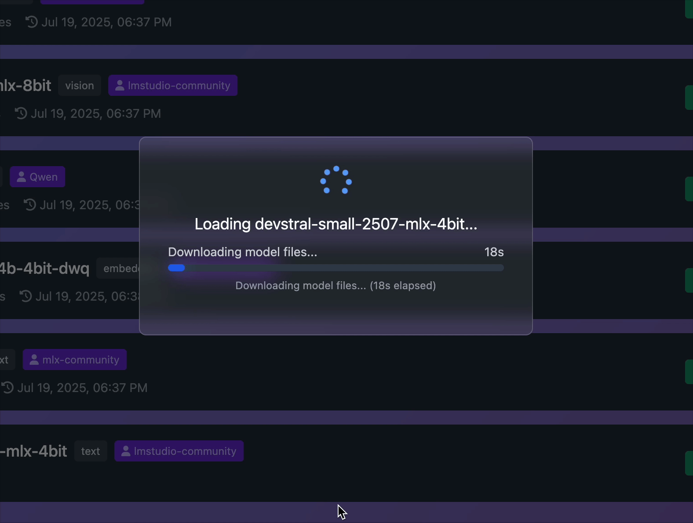

```
███╗   ███╗██╗     ██╗  ██╗      ██████╗ ██╗   ██╗██╗
████╗ ████║██║     ╚██╗██╔╝     ██╔════╝ ██║   ██║██║
██╔████╔██║██║      ╚███╔╝█████╗██║  ███╗██║   ██║██║
██║╚██╔╝██║██║      ██╔██╗╚════╝██║   ██║██║   ██║██║
██║ ╚═╝ ██║███████╗██╔╝ ██╗     ╚██████╔╝╚██████╔╝██║
╚═╝     ╚═╝╚══════╝╚═╝  ╚═╝      ╚═════╝  ╚═════╝ ╚═╝
```


[](https://www.gnu.org/licenses/gpl-3.0)
[](https://www.python.org/downloads/)
[](https://support.apple.com/en-us/HT211814)
[](https://github.com/ml-explore/mlx)

<div align="center">

</div>

**A lightweight Inference Server for Apple's MLX engine with a GUI.**

>*TLDR - OpenRouter-style v1 API interface for MLX with Ollama-like model management, featuring auto-queuing, on-demand model loading, and multi-user serving capabilities via single mac app.*

## 📦 Latest Release

### v1.2.3 - Real-Time Model Status & Model Support (July 19 2025)

🚀 **Real-Time Status Monitoring**
- ✅ **Live Model Status** - Added real-time status tracking for model loading, including download progress.
- 📊 **Detailed Status View** - See download percentage, speed, and ETA directly in the UI.
- 🐛 **Fixed Status Endpoint** - Resolved a critical bug causing the server to crash when checking model status.
- 🖼️ **See it in action:**
  

🧪 **New API Test Console**
- ✅ **Built-in API Testing** - Added dedicated API Test tab in the admin interface for single-turn testing
- 🎯 **Model Selection** - Test any loaded model with customizable parameters (temperature, max tokens, system messages)
- 📊 **Response Analytics** - View response time, token count, and detailed statistics
- 📝 **Test History** - Keep track of recent API tests with timestamps and performance metrics
- ⚡ **Quick Validation** - Perfect for testing model responses and API functionality
🚀 **Comprehensive Model Ecosystem**
- ✅ **15+ New Verified Models** - Added support for trending MLX models including SmolLM3, Kimi-K2, Gemma-3n, and more
- 🧠 **Trillion-Parameter Support** - Added detection for ultra-large models like Kimi-K2-Instruct (1.02T parameters)
- 🎯 **Enhanced Model Discovery** - Improved trending models endpoint with curated high-performance models
- 🔍 **Smart Multimodal Detection** - Fixed classification for models like Gemma-3n to properly show as "Multimodal"

🎨 **New Verified Tested Models**
- **SmolLM3-3B-4bit** - Multilingual 481M parameter model with 8-language support
- **Kimi-Dev-72B-4bit-DWQ** - Large reasoning model with advanced capabilities
- **Kimi-K2-Instruct-4bit** - Ultra-large 1.02T parameter instruction-tuned model
- **Llama-3.2-3B-Instruct-4bit** - Meta's instruction-following model with 502M parameters
- **Gemma-2-9B-it-4bit** - Google's advanced reasoning model with 1.44B parameters
- **Qwen3-30B-A3B-4bit-DWQ** - MoE model with 30B total/3B active parameters
- **Gemma-3n-E4B-it-MLX-4bit** - Advanced multimodal model with image/audio/text capabilities

🔧 **Technical Improvements**
- 🎯 **Improved Model Type Classification** - Enhanced detection for multimodal models with image-text-to-text capabilities
- 📊 **Expanded Parameter Patterns** - Added support for trillion-scale model memory estimation
- 🧪 **Comprehensive Test Suite** - Added dedicated test scripts for all new models with streaming/non-streaming validation
- 🔄 **Install-Load Workflow** - Updated all tests to follow proper MLX-GUI model lifecycle (install → load → use)

### v1.2.2 - Complete CyberAI Image Compatibility (July 15 2025)

🔧 **Critical CyberAI Fix**
- ✅ **Raw Base64 Image Support** - Fixed CyberAI images by adding support for raw base64 data (no `data:image/` prefix)
- 🔍 **Automatic Format Detection** - Detects PNG, JPEG, GIF, and WebP from binary headers
- 🛠️ **Enhanced Image Processing** - Improved raw base64 validation and error handling
- ✅ **Verified Fix** - Tested and confirmed working with actual CyberAI client requests

### v1.2.1 - Enhanced Image Compatibility (July 15 2025)

🖼️ **Improved Vision Model Compatibility**
- ✅ **Enhanced Image Format Support** - Fixed vision models not seeing images from certain OpenAI-compatible clients
- 🔧 **Multiple Image URL Formats** - Now supports various ways clients send images (`image_url.url`, `image_url.image`, direct `image` fields)
- 🤖 **CyberAI Compatibility** - Resolved image processing issues with CyberAI and other third-party clients
- 🛠️ **Robust Image Parsing** - Added fallback handling for different OpenAI API image formats
- 🎯 **Better Error Handling** - Improved debugging and error messages for image processing failures

### v1.2.0 - Advanced Memory Management & VLM Stability (July 13 2025)

🧠 **Revolutionary Memory Management**
- ✅ **Intelligent Auto-Unload System** - Automatically unloads oldest models when memory limits are reached
- 🔄 **Three-Layer Memory Protection** - Proactive cleanup, concurrent limits, and emergency memory recovery
- ⚡ **Memory Error Detection** - Detects MLX memory errors and retries with automatic model unloading
- 📊 **Smart LRU Eviction** - Least Recently Used models are automatically freed to make room for new ones, this is 🪟TRANSPARENT to the users.
- 🛡️ **Memory Overload Recovery** - Up to 3 retry attempts with intelligent memory cleanup between attempts
- ⚡️ **Core Updates** - Updated to MLX-LM 0.26.0 and MLX-VLM 0.3.1

🔧 **Enhanced VLM Stability**
- 🖼️ **Fixed Vision Model Queue Issues** - Resolved concurrent loading problems with MLX-VLM models
- 🎯 **Improved Image Token Handling** - Better processing of vision inputs in queue system
- 🔄 **Robust Multimodal Support** - Enhanced stability for Gemma-3n, Qwen2-VL, and LLaVA models
- 📸 **Optimized Memory Usage** - Better memory management for large vision models

🚀 **Performance Improvements**
- ⚡ **Faster Model Loading** - Optimized queue processing with better error handling
- 🏗️ **Enhanced Concurrent Processing** - Improved handling of multiple simultaneous requests
- 📈 **Better Resource Utilization** - Smarter memory allocation and cleanup strategies
- 🔍 **Comprehensive Testing** - Added memory overload tests and queue verification

🛠️ **Technical Enhancements**
- 🧪 **Advanced Testing Suite** - New memory management tests and VLM stability verification
- 📝 **Improved Logging** - Better visibility into memory management and model lifecycle
- 🔧 **Enhanced Error Recovery** - More robust handling of edge cases and memory constraints

**Download:** [Latest Release](https://github.com/RamboRogers/mlx-gui/releases/latest)

## Why ?

 1. ✅ Why MLX? Llama.cpp and Ollama are great, but they are slower than MLX. MLX is a native Apple Silicon framework that is optimized for Apple Silicon. Plus, it's free and open source, and this have a nice GUI.

 2. ⚡️ I wanted to turn my mac Mini and a Studio into more useful multiuser inference servers that I don't want to manage.

 3. 🏗️ I just want to build AI things and not manage inference servers, or pay for expensive services while maintaining sovereignty of my data.


<div align="center">
<table>
<th colspan=2>GUI</th>
<tr><td></td><td></td></tr>
<tr><td></td><td></td></tr>
<th colspan=2>Mac Native</th>
<tr><td></td><td></td></tr>
</table>
</div>


## 🚀 Features

- **🧠 MLX Engine Integration** - Native Apple Silicon acceleration via MLX
- **🔄 Intelligent Memory Management** - Advanced auto-unload system with LRU eviction and memory error recovery
- **🛡️ Three-Layer Memory Protection** - Proactive cleanup, concurrent limits, and emergency memory recovery
- **🌐 REST API Server** - Complete API for model management and inference
- **🎨 Beautiful Admin Interface** - Modern web GUI for model management
- **📊 System Monitoring** - Real-time memory usage and system status with memory warnings
- **🔍 HuggingFace Integration** - Discover and install MLX-compatible models
- **🎙️ Audio Support** - Speech-to-text with Whisper and Parakeet models
- **🖼️ Vision Models** - Image understanding with Gemma-3n, Qwen2-VL, LLaVA models (enhanced stability)
- **🔢 Embeddings Support** - Text embeddings with OpenAI-compatible API
- **🍎 macOS System Tray** - Native menu bar integration
- **⚡ OpenAI Compatibility** - Drop-in replacement for OpenAI API
- **📱 Standalone App** - Packaged macOS app bundle (no Python required)

## 📋 Requirements

- **macOS** (Apple Silicon M1/M2/M3/M4 required)
- **Python 3.11+** (for development)
- **8GB+ RAM** (16GB+ recommended for larger models)

## 🏃‍♂️ Quick Start

### Option 1: Download Standalone App (Recommended for Mac Users)
1. Download the latest `.app` from [Releases](https://github.com/RamboRogers/mlx-gui/releases)
2. Drag to `/Applications`
3. Launch - no Python installation required!
4. From the menu bar, click the MLX icon to open the admin interface.
5. Discover and install models from HuggingFace.
6. Connect your AI app to the API endpoint.

> *📝 Models may take a few minutes to load. They are gigabytes in size and will download at your internet speed.*

### Option 2: Install from PyPI
```bash
# Install MLX-GUI
pip install mlx-gui

# Launch with system tray
mlx-gui tray

# Or launch server only
mlx-gui start --port 8000
```

### Option 3: Install from Source
```bash
# Clone the repository
git clone https://github.com/RamboRogers/mlx-gui.git
cd mlx-gui

# Install dependencies
pip install -e ".[app]"

# Launch with system tray
mlx-gui tray

# Or launch server only
mlx-gui start --port 8000
```

## 🎮 Usage

### An API Endpoint for [Jan](https://jan.ai) or any other AI app

Simply configure the API endpoint in the app settings to point to your MLX-GUI server. This works with any AI app that supports the OpenAI API. Enter anything for the API key.

<div align="center">
<table>
<tr><td></td><td></td></tr>
</table>
</div>

### System Tray (Recommended)

Launch the app and look for **MLX** in your menu bar:

<div align="center">

</div>

- **Open Admin Interface** - Web GUI for model management
- **System Status** - Real-time monitoring
- **Unload All Models** - Free up memory
- **Network Settings** - Configure binding options

### Web Admin Interface
Navigate to `http://localhost:8000/admin` for:
- 🔍 **Discover Tab** - Browse and install MLX models from HuggingFace
- 🧠 **Models Tab** - Manage installed models (load/unload/remove)
- 📊 **Monitor Tab** - System statistics and performance
- ⚙️ **Settings Tab** - Configure server and model options

### API Usage

#### OpenAI-Compatible Chat
```bash
curl -X POST http://localhost:8000/v1/chat/completions \
  -H "Content-Type: application/json" \
  -d '{
    "model": "qwen3-8b-6bit",
    "messages": [{"role": "user", "content": "Hello!"}],
    "max_tokens": 100
  }'
```

#### Vision Models with Images
```bash
curl -X POST http://localhost:8000/v1/chat/completions \
  -H "Content-Type: application/json" \
  -d '{
    "model": "qwen2-vl-2b-instruct",
    "messages": [{
      "role": "user",
      "content": [
        {"type": "text", "text": "What do you see in this image?"},
        {"type": "image_url", "image_url": {"url": "data:image/jpeg;base64,/9j/4AAQ..."}}
      ]
    }],
    "max_tokens": 200
  }'
```

#### Audio Transcription
```bash
curl -X POST http://localhost:8000/v1/audio/transcriptions \
  -H "Content-Type: multipart/form-data" \
  -F "file=@audio.wav" \
  -F "model=parakeet-tdt-0-6b-v2"
```

#### Text Embeddings
```bash
curl -X POST http://localhost:8000/v1/embeddings \
  -H "Content-Type: application/json" \
  -d '{
    "input": ["Hello world", "How are you?"],
    "model": "qwen3-embedding-0-6b-4bit"
  }'
```

#### Install Models
```bash
# Install text model
curl -X POST http://localhost:8000/v1/models/install \
  -H "Content-Type: application/json" \
  -d '{
    "model_id": "mlx-community/Qwen2.5-7B-Instruct-4bit",
    "name": "qwen-7b-4bit"
  }'

# Install audio model
curl -X POST http://localhost:8000/v1/models/install \
  -H "Content-Type: application/json" \
  -d '{
    "model_id": "mlx-community/parakeet-tdt-0.6b-v2",
    "name": "parakeet-tdt-0-6b-v2"
  }'

# Install vision model
curl -X POST http://localhost:8000/v1/models/install \
  -H "Content-Type: application/json" \
  -d '{
    "model_id": "mlx-community/Qwen2-VL-2B-Instruct-4bit",
    "name": "qwen2-vl-2b-instruct"
  }'

# Install embedding model
curl -X POST http://localhost:8000/v1/models/install \
  -H "Content-Type: application/json" \
  -d '{
    "model_id": "mlx-community/Qwen3-Embedding-0.6B-4bit-DWQ",
    "name": "qwen3-embedding-0-6b-4bit"
  }'
```

## 🏗️ Architecture

```
┌─────────────────┐    ┌──────────────────┐    ┌─────────────────┐
│  System Tray    │    │   Web Admin GUI  │    │   REST API      │
│  (macOS)        │◄──►│  (localhost:8000)│◄──►│  (/v1/*)        │
└─────────────────┘    └──────────────────┘    └─────────────────┘
                                                         │
                       ┌─────────────────┐              │
                       │ Model Manager   │◄─────────────┘
                       │ (Queue/Memory)  │
                       └─────────────────┘
                                │
                       ┌─────────────────┐
                       │  MLX Engine     │
                       │ (Apple Silicon) │
                       └─────────────────┘
```

## 📚 API Documentation

Full API documentation is available at `/v1/docs` when the server is running, or see [API.md](API.md) for complete endpoint reference.

### Key Endpoints
- `GET /v1/models` - List installed models
- `POST /v1/models/install` - Install from HuggingFace
- `POST /v1/models/{name}/load` - Load model into memory
- `POST /v1/chat/completions` - OpenAI-compatible chat (text + images)
- `POST /v1/embeddings` - Generate text embeddings
- `POST /v1/audio/transcriptions` - Audio transcription (Whisper/Parakeet)
- `GET /v1/discover/models` - Search HuggingFace for MLX models
- `GET /v1/discover/embeddings` - Search for embedding models
- `GET /v1/system/status` - System and memory status

## 🛠️ Development

### Setup Development Environment
```bash
git clone https://github.com/RamboRogers/mlx-gui.git
cd mlx-gui

# Create virtual environment
python -m venv .venv
source .venv/bin/activate

# Install in development mode with audio and vision support
pip install -e ".[dev,audio,vision]"

# Run tests
pytest

# Start development server
mlx-gui start --reload
```

### Build Standalone App
```bash
# Install build dependencies with audio and vision support
pip install rumps pyinstaller mlx-whisper parakeet-mlx mlx-vlm

# Build macOS app bundle
./build_app.sh

# Result: dist/MLX-GUI.app
```

## 🤝 Contributing

1. Fork the repository
2. Create a feature branch (`git checkout -b feature/amazing-feature`)
3. Commit your changes (`git commit -m 'Add amazing feature'`)
4. Push to the branch (`git push origin feature/amazing-feature`)
5. Open a Pull Request

## ⚖️ License

<p>
MLX-GUI is licensed under the GNU General Public License v3.0 (GPLv3).<br>
<em>Free Software</em>
</p>

[](https://www.gnu.org/licenses/gpl-3.0)

### Connect With Me 🤝

[](https://github.com/RamboRogers)
[](https://x.com/rogerscissp)
[](https://matthewrogers.org)

## 🙏 Acknowledgments

- [Apple MLX Team](https://github.com/ml-explore/mlx) - For the incredible MLX framework
- [MLX-LM](https://github.com/ml-explore/mlx-examples/tree/main/llms) - MLX language model implementations
- [HuggingFace](https://huggingface.co) - For the model hub and transformers library


## ⭐ Star History

[](https://www.star-history.com/#RamboRogers/mlx-gui&Timeline)

---

<div align="center">
  <strong>Made with ❤️ for the Apple Silicon community</strong>
</div>
