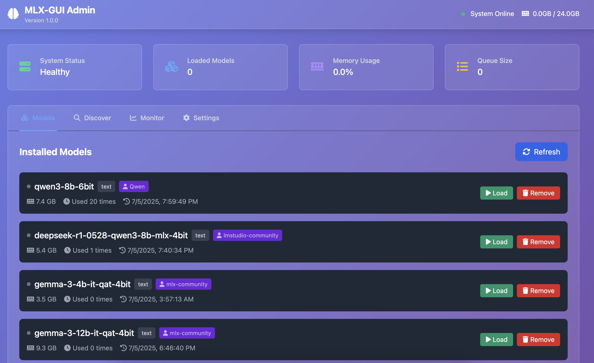
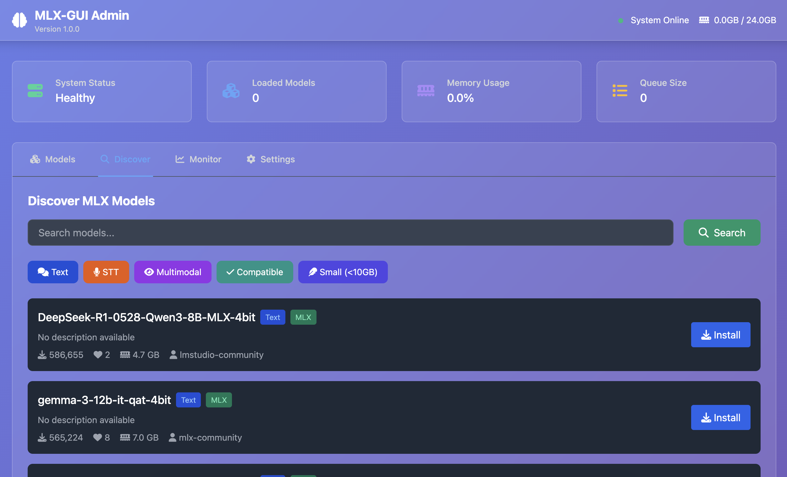
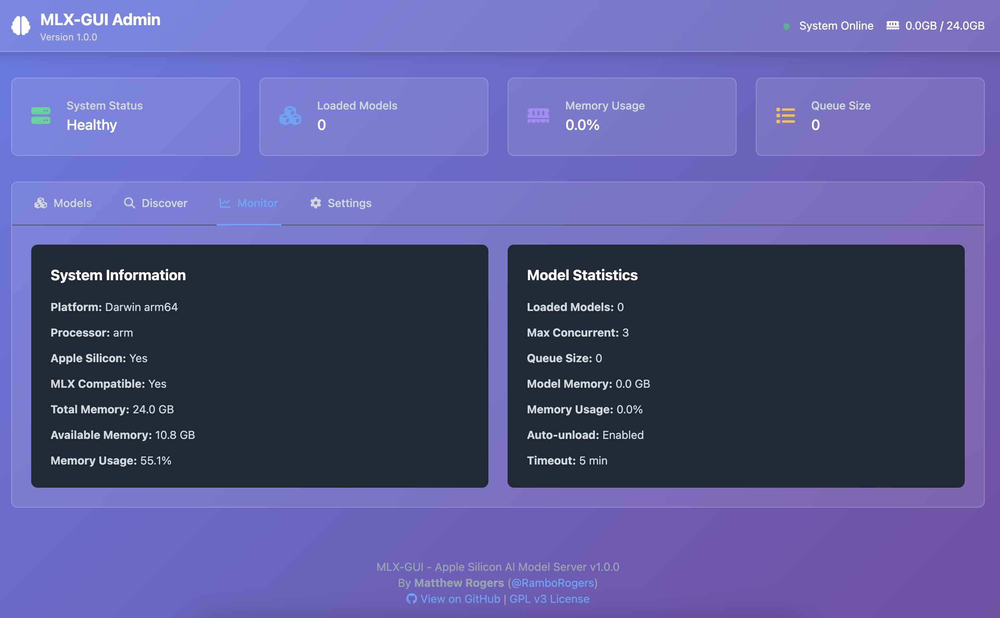
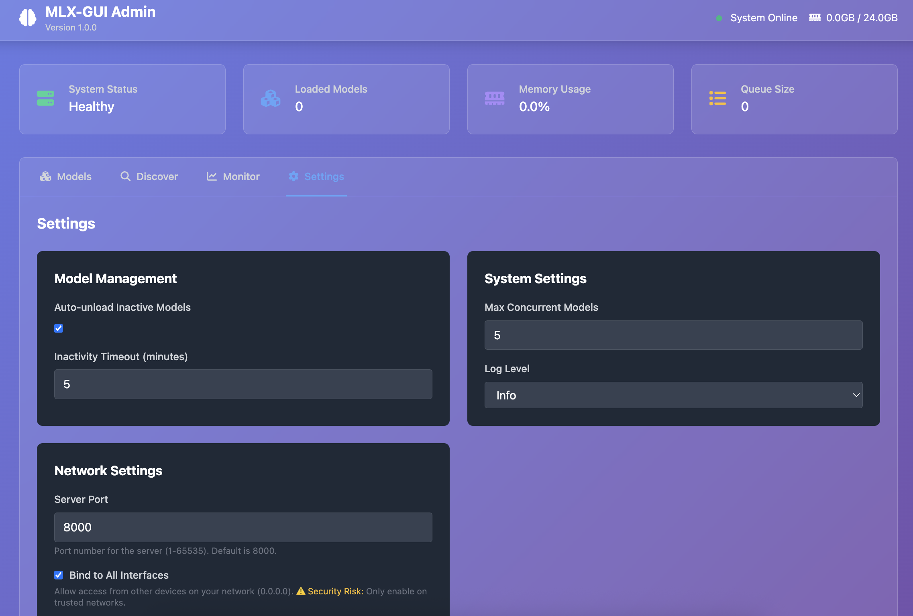
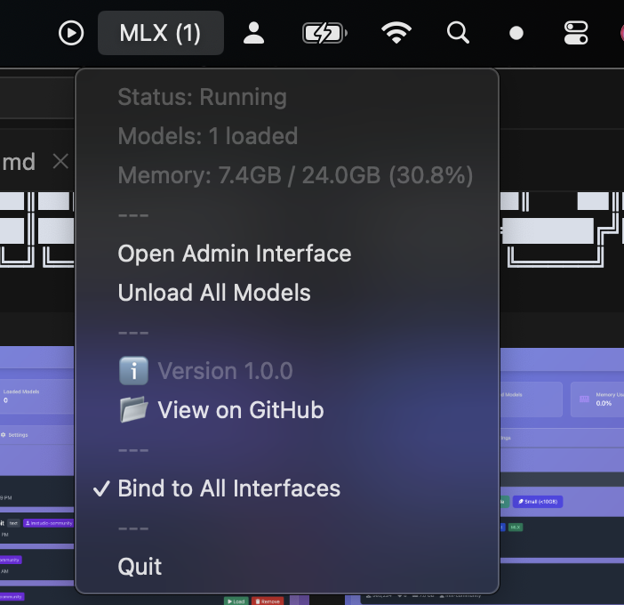
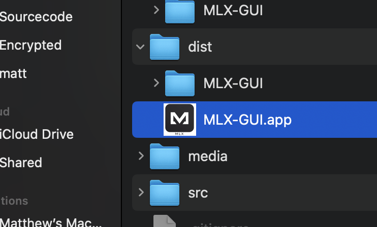
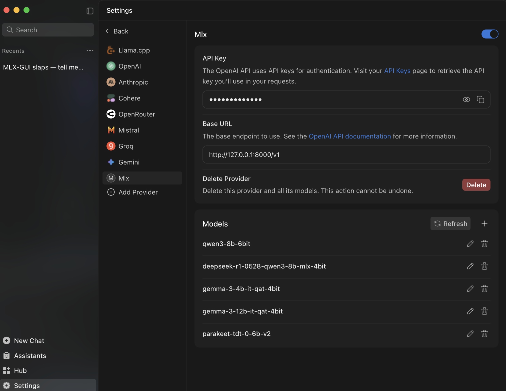
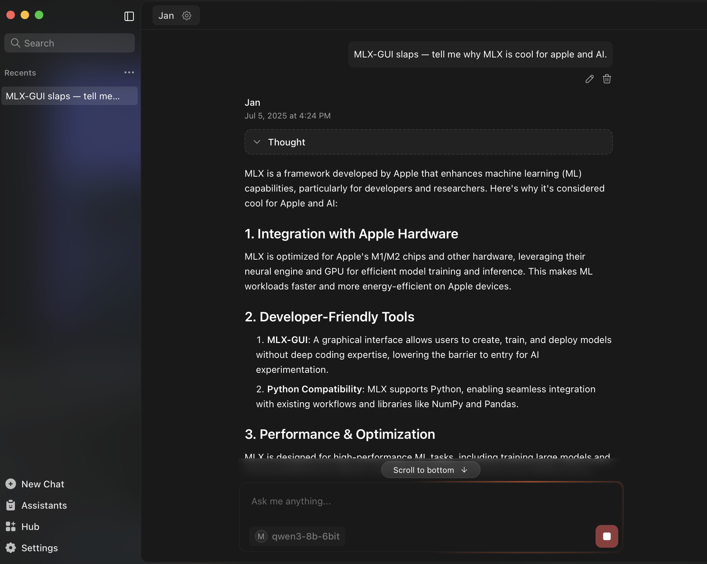

```
███╗   ███╗██╗     ██╗  ██╗      ██████╗ ██╗   ██╗██╗
████╗ ████║██║     ╚██╗██╔╝     ██╔════╝ ██║   ██║██║
██╔████╔██║██║      ╚███╔╝█████╗██║  ███╗██║   ██║██║
██║╚██╔╝██║██║      ██╔██╗╚════╝██║   ██║██║   ██║██║
██║ ╚═╝ ██║███████╗██╔╝ ██╗     ╚██████╔╝╚██████╔╝██║
╚═╝     ╚═╝╚══════╝╚═╝  ╚═╝      ╚═════╝  ╚═════╝ ╚═╝
```


[](https://www.gnu.org/licenses/gpl-3.0)
[](https://www.python.org/downloads/)
[](https://support.apple.com/en-us/HT211814)
[](https://github.com/ml-explore/mlx)

<div align="center">

</div>

**The Swiss Army Knife of Apple Silicon AI - A lightweight Inference Server for Apple's MLX engine with a GUI.**

>*TLDR - OpenRouter-style v1 API interface for MLX with Ollama-like model management, featuring auto-queuing, on-demand model loading, and multi-user serving capabilities via single mac app.*

## 🚀 Apps using MLX-GUI

### 🎤 MLX-Transcribe - Lightning-Fast Voice Transcription

<div align="center">

</div>

**[MLX-Transcribe](https://github.com/RamboRogers/MLX-Transcribe)** is a native macOS transcription app that transforms your voice into text instantly at your cursor position. Built with Apple Silicon optimization and seamless MLX-GUI integration, it delivers privacy-first, lightning-fast transcription.

**Key Features:**
- ⚡ **Instant Transcription** - Press `Control + ~` and speak - text appears instantly at your cursor
- 🤖 **MLX-GUI Integration** - Seamless local AI processing with automatic Parakeet model management
- 🛡️ **Privacy First** - Your voice never leaves your machine with local processing
- 🎯 **Universal Cursor** - Works in any app - editors, browsers, chat apps, terminals
- 🚀 **Native Menu Bar** - Lightweight, always-accessible macOS integration

*Perfect companion to MLX-GUI for developers, writers, and anyone who values speed and privacy in voice-to-text workflows.*

---

## 📦 Latest Release

### 🎉 v1.2.4 - Universal AI Ecosystem (July 22 2025)

**From Whisper to Embeddings in One API** - 23 embedding models, 99 languages, complete audio/vision/text pipeline. Production-ready, not promises.

<div align="center">

</div>

#### 🚀 **NEW: Advanced Audio Intelligence**
- 🎙️ **Complete Whisper Ecosystem** - All variants (Tiny to Large v3) with automatic fallback - never fails!
- 🌍 **99+ Languages** - Auto-detection with no configuration needed
- ⏱️ **Word-Level Timestamps** - Perfect for subtitles, content indexing, and meeting analysis
- 📼 **Universal Format Support** - WAV, MP3, MP4, M4A, FLAC, OGG, WebM - any audio format works
- 🎯 **Parakeet TDT** - Lightning-fast transcription for real-time applications
- 🎨 **Beautiful Audio UI** - Drag-and-drop interface with 11 languages and 5 output formats


#### 🧠 **NEW: Complete Embedding Ecosystem**
- 🌟 **23+ Models, 13 Families** - E5, ModernBERT, Arctic, GTE, BGE, MiniLM, Qwen3, SentenceT5, Jina AI, and more!
- 🔧 **Triple Library Support** - Seamlessly integrates mlx_embedding_models, mlx_embeddings, AND sentence-transformers
- 🧪 **Battle-Tested** - 553 lines of embedding tests + 338 lines of audio tests ensure reliability
- 📏 **Any Dimension** - From efficient 384-dim to powerful 4096-dim embeddings
- 🎯 **Smart Architecture Detection** - Automatically optimizes extraction for each model type
- 🔢 **L2-Normalized Vectors** - Production-ready for similarity search and RAG applications

#### 🤖 **NEW: Mistral Small Integration**
- ✨ **24B Parameter Model** - Full support for Mistral-Small-3.2-24B-Instruct
- 🎨 **Vision-Text Capability** - Advanced multimodal processing via MLX-VLM
- 🧪 **Test Suite Integration** - Comprehensive testing ensuring reliable performance
- 🔧 **Smart Classification** - Automatic detection and proper model type assignment

#### 🛠️ **Technical Excellence**
- 🧪 **900+ Lines of Tests** - Comprehensive test coverage for production reliability
- 🔍 **New Discovery Endpoint** - `/v1/discover/stt` for easy speech-to-text model discovery
- 🎯 **Never-Fail Architecture** - Smart Whisper fallback ensures audio transcription always works
- 📊 **Enhanced Memory Management** - Optimized loading for large embedding and audio models
- 🔄 **Intelligent Queue System** - Handles diverse result types (lists, arrays, dicts) seamlessly
- ⚡ **Performance Optimization** - Faster model switching and concurrent processing

---

## 📚 Previous Releases

<details>
<summary><strong>v1.2.3</strong> - Real-Time Model Status & Model Support (July 19 2025)</summary>

**Key Features:**
- 🚀 Real-time status monitoring with download progress
- 🧪 Built-in API test console with response analytics
- 🎨 15+ new verified models including SmolLM3, Kimi-K2, Gemma-3n
- 🧠 Trillion-parameter model support
- 🔧 Enhanced model type classification

</details>

<details>
<summary><strong>v1.2.0-v1.2.2</strong> - Memory Management & Vision Compatibility</summary>

**Key Features:**
- 🧠 Revolutionary auto-unload system with LRU eviction
- 🖼️ Complete CyberAI image compatibility
- 🔄 Three-layer memory protection
- 📸 Enhanced VLM stability for vision models
- 🛠️ Raw base64 image support

</details>

**Download:** [Latest Release](https://github.com/RamboRogers/mlx-gui/releases/latest)

## Why ?

 1. ✅ Why MLX? Llama.cpp and Ollama are great, but they are slower than MLX. MLX is a native Apple Silicon framework that is optimized for Apple Silicon. Plus, it's free and open source, and this have a nice GUI.

 2. ⚡️ I wanted to turn my mac Mini and a Studio into more useful multiuser inference servers that I don't want to manage.

 3. 🏗️ I just want to build AI things and not manage inference servers, or pay for expensive services while maintaining sovereignty of my data.


<div align="center">
<table>
<th colspan=2>GUI</th>
<tr><td></td><td></td></tr>
<tr><td></td><td></td></tr>
<th colspan=2>Mac Native</th>
<tr><td></td><td></td></tr>
</table>
</div>


## 🚀 Features

### 🎯 **Universal AI Capabilities**
- **🧠 MLX Engine Integration** - Native Apple Silicon acceleration via MLX
- **🎙️ Advanced Audio Intelligence** - Complete Whisper & Parakeet support with multi-format processing
- **🔢 Production Embeddings** - Multi-architecture support (BGE, MiniLM, Qwen3, Arctic, E5)
- **🖼️ Vision Models** - Image understanding with Gemma-3n, Qwen2-VL, Mistral Small (enhanced stability)
- **🤖 Large Language Models** - Full support for instruction-tuned and reasoning models

### 🛠️ **Enterprise-Grade Infrastructure**
- **🔄 Intelligent Memory Management** - Advanced auto-unload system with LRU eviction
- **🛡️ Three-Layer Memory Protection** - Proactive cleanup, concurrent limits, emergency recovery
- **⚡ OpenAI Compatibility** - Drop-in replacement for OpenAI API endpoints
- **🌐 REST API Server** - Complete API for model management and inference
- **📊 Real-Time Monitoring** - System status, memory usage, and model performance

### 🎨 **User Experience**
- **🎨 Beautiful Admin Interface** - Modern web GUI for model management
- **🔍 HuggingFace Integration** - Discover and install MLX-compatible models
- **🍎 macOS System Tray** - Native menu bar integration
- **📱 Standalone App** - Packaged macOS app bundle (no Python required)

## 🔍 Multi-Language RAG System

### 🌟 **Language Support Overview**

MLX-GUI features a comprehensive **Retrieval-Augmented Generation (RAG)** system that understands code across **17 programming languages**. From Python to Dart/Flutter, your AI can now provide contextual answers about any codebase.

#### **✅ Supported Languages**

| Language | Extension(s) | Parser Type | Status |
|----------|--------------|-------------|--------|
| **Python** | `.py` | Tree-sitter | ✅ Built-in |
| **JavaScript** | `.js`, `.jsx` | Tree-sitter | 🔧 Optional |
| **TypeScript** | `.ts`, `.tsx` | Tree-sitter | 🔧 Optional |
| **Java** | `.java` | Tree-sitter | 🔧 Optional |
| **C++** | `.cpp`, `.cc`, `.cxx`, `.hpp` | Tree-sitter | 🔧 Optional |
| **C** | `.c`, `.h` | Tree-sitter | 🔧 Optional |
| **Go** | `.go` | Tree-sitter | 🔧 Optional |
| **Rust** | `.rs` | Tree-sitter | 🔧 Optional |
| **Bash/Shell** | `.sh`, `.bash` | Tree-sitter | 🔧 Optional |
| **🎯 Dart/Flutter** | `.dart` | Pattern-based | ✅ **Built-in** |

> **🎯 Special Focus: Dart/Flutter** - Full built-in support with Flutter-aware parsing for widgets, async functions, streams, and state management patterns.

### 🚀 **Quick RAG Setup**

#### **1. Create a RAG Collection**
```bash
# Via API
curl -X POST "http://localhost:8000/v1/rag/collections" \
  -d "name=MyProject&path=/path/to/your/codebase"

# Via Web UI
# Navigate to localhost:8000/admin → RAG tab → Create Collection
```

#### **2. Check Language Support Status**
```bash
# Check which parsers are available
uv run python install_language_parsers.py

# Or via API
curl -s "http://localhost:8000/v1/rag/languages" | jq
```

#### **3. Query Your Codebase**
```bash
# Ask questions about your code
curl -X POST "http://localhost:8000/v1/rag/query" \
  -d "query=How does the authentication system work?"

# Or use chat with RAG context
curl -X POST "http://localhost:8000/v1/chat" \
  -H "Content-Type: application/json" \
  -d '{
    "message": "Explain the main Flutter widgets in this app",
    "model": "qwen2.5-coder-7b-instruct",
    "rag_collection": "MyFlutterApp"
  }'
```

### 🔧 **Installing Language Parsers**

#### **Option 1: Install All Language Support**
```bash
# Using uv (recommended)
uv sync --extra rag-full

# Or via pip
pip install mlx-gui[rag-full]
```

#### **Option 2: Install Specific Languages**
```bash
# Interactive installer
uv run python install_language_parsers.py --install javascript typescript java

# Manual installation
pip install tree-sitter-javascript tree-sitter-typescript tree-sitter-java
```

#### **Option 3: Check Installation Status**
```bash
# See what's installed and what's missing
uv run python install_language_parsers.py

# Install all missing parsers
uv run python install_language_parsers.py --install-missing
```

### 🎯 **Dart/Flutter RAG Features**

Dart/Flutter support is **built-in** and requires no additional setup! The system automatically recognizes:

#### **Flutter Widget Detection**
```dart
// ✅ Detected as 'flutter_widget'
class MyHomePage extends StatefulWidget {
  @override
  _MyHomePageState createState() => _MyHomePageState();
}

class LoginScreen extends StatelessWidget {
  @override
  Widget build(BuildContext context) {
    return Scaffold(...);
  }
}
```

#### **Async Function Recognition**
```dart
// ✅ Detected as 'async_function'
Future<UserData> fetchUserProfile(String userId) async {
  final response = await http.get(Uri.parse('/api/users/$userId'));
  return UserData.fromJson(response.body);
}

// ✅ Detected as 'stream_function'
Stream<List<Message>> watchMessages() async* {
  await for (final snapshot in FirebaseFirestore.instance
      .collection('messages').snapshots()) {
    yield snapshot.docs.map((doc) => Message.fromDoc(doc)).toList();
  }
}
```

#### **Standard Dart Patterns**
```dart
// ✅ Detected as 'void_function'
void main() {
  runApp(MyApp());
}

// ✅ Detected as 'class'
class DatabaseHelper {
  static final DatabaseHelper _instance = DatabaseHelper._internal();
  factory DatabaseHelper() => _instance;
}
```

### 📊 **RAG API Endpoints**

#### **🔧 Collection Management**
```bash
# Create a new RAG collection
POST /v1/rag/collections
{
  "name": "MyProject",
  "path": "/path/to/codebase"
}

# List all collections
GET /v1/rag/collections

# Activate a collection
POST /v1/rag/collections/{name}/activate

# Reprocess a collection (after code changes)
POST /v1/rag/collections/{name}/reprocess

# Delete a collection
DELETE /v1/rag/collections/{name}
```

#### **🔍 Language Support**
```bash
# Get supported languages and their status
GET /v1/rag/languages

# Example response:
{
  "languages": [
    {
      "extension": ".dart",
      "language": "Dart/Flutter", 
      "available": true,
      "node_types": ["class", "function", "method"],
      "package_name": "built-in"
    }
  ],
  "summary": {
    "total_languages": 17,
    "available_languages": 10,
    "missing_languages": 7
  }
}
```

#### **🎯 RAG Queries**
```bash
# Query the active RAG collection
POST /v1/rag/query
{
  "query": "How do I implement user authentication?"
}

# Chat with RAG context (recommended)
POST /v1/chat
{
  "message": "Explain the Flutter navigation system",
  "model": "qwen2.5-coder-7b-instruct", 
  "rag_collection": "MyFlutterApp",
  "history": []
}
```

### 🔍 **Adding New Languages**

Want to add support for a new programming language? Here's how:

#### **1. Tree-sitter Based (Recommended)**
```python
# Add to rag_manager.py language_config
'.your_ext': {
    'language': YOUR_LANGUAGE_PARSER,
    'parser': Parser() if YOUR_LANGUAGE_PARSER else None,
    'name': 'Your Language',
    'node_types': ['function_definition', 'class_definition'],
    'name_field': 'name'
}
```

#### **2. Pattern-based (Like Dart)**
```python
# Add to rag_manager.py language_config
'.your_ext': {
    'language': None,  # No tree-sitter parser
    'parser': None,
    'name': 'Your Language',
    'node_types': ['function', 'class'],
    'name_field': 'name',
    'text_patterns': [  # Regex patterns for detection
        r'function\s+([A-Za-z_][A-Za-z0-9_]*)\s*\(',
        r'class\s+([A-Za-z_][A-Za-z0-9_]*)\s*\{'
    ]
}
```

#### **3. Add to pyproject.toml (Optional)**
```toml
[project.optional-dependencies]
rag-full = [
    # ... existing parsers ...
    "tree-sitter-yourlanguage>=0.21.0",
]
```

### 💡 **RAG Best Practices**

#### **🎯 Collection Organization**
- **One collection per project** - Keep related code together
- **Exclude build directories** - The system automatically skips common build dirs
- **Include documentation** - README files and comments are indexed too
- **Reprocess after major changes** - Keep your RAG knowledge up-to-date

#### **📝 Query Optimization**
- **Be specific** - "How does user authentication work?" vs "What is this?"
- **Use technical terms** - "JWT token validation" vs "login stuff"
- **Reference file names** - "How does utils.dart handle network requests?"
- **Ask about patterns** - "Show me all StatefulWidgets" or "Find async functions"

#### **🔧 Performance Tips**
- **Load your language model first** - RAG requires a loaded model to generate responses
- **Use appropriate chunk sizes** - The system optimizes automatically
- **Monitor collection status** - Check `/v1/rag/collections` for processing status

### 🧪 **Testing Your RAG Setup**

```bash
# 1. Check language support status
uv run python install_language_parsers.py

# 2. Test the RAG manager directly
uv run python -c "
from mlx_gui.rag_manager import get_rag_manager
rag = get_rag_manager()
print(f'Supported extensions: {list(rag.language_config.keys())}')
"

# 3. Create a test collection
curl -X POST 'http://localhost:8000/v1/rag/collections' \
  -d 'name=TestProject&path=/Users/you/Code/your-project'

# 4. Query your codebase
curl -X POST 'http://localhost:8000/v1/rag/query' \
  -d 'query=What functions are defined in this codebase?'
```

## 🤖 Tested Models

**Text Generation**
- `qwen3-8b-6bit` - Qwen3 8B quantized model
- `deepseek-r1-0528-qwen3-8b-mlx-8bit` - DeepSeek R1 reasoning model
- `smollm3-3b-4bit` / `smollm3-3b-bf16` - SmolLM3 multilingual models
- `gemma-3-27b-it-qat-4bit` - Google Gemma 3 27B instruction-tuned
- `mistral-small-3-2-24b-instruct-2506-mlx-4bit` - Mistral Small 24B with vision
- `devstral-small-2507-mlx-4bit` - Devstral coding model

**Vision Models**
- `gemma-3n-e4b-it` / `gemma-3n-e4b-it-mlx-8bit` - Gemma 3n vision models
- `mistral-small-3-2-24b-instruct-2506-mlx-4bit` - Multimodal capabilities

**Audio Transcription**
- `whisper-large-v3-turbo` - OpenAI Whisper Turbo for fast transcription
- `parakeet-tdt-0-6b-v2` - Ultra-fast Parakeet speech-to-text

**Text Embeddings**
- `qwen3-embedding-4b-4bit-dwq` - Qwen3 embeddings (2560 dimensions)
- `bge-small-en-v1-5-bf16` - BGE embeddings (384 dimensions)
- `all-minilm-l6-v2-4bit` / `all-minilm-l6-v2-bf16` - MiniLM embeddings
- `snowflake-arctic-embed-l-v2-0-4bit` - Arctic embeddings (1024 dimensions)

## 📋 Requirements

- **macOS** (Apple Silicon M1/M2/M3/M4 required)
- **Python 3.11+** (for development)
- **8GB+ RAM** (16GB+ recommended for larger models)

## 🏃‍♂️ Quick Start

### Option 1: Download Standalone App (Recommended for Mac Users)
1. Download the latest `.app` from [Releases](https://github.com/RamboRogers/mlx-gui/releases)
2. Drag to `/Applications`
3. Launch - no Python installation required!
4. From the menu bar, click the MLX icon to open the admin interface.
5. Discover and install models from HuggingFace.
6. Connect your AI app to the API endpoint.

> *📝 Models may take a few minutes to load. They are gigabytes in size and will download at your internet speed.*

### Option 2: Install from PyPI
```bash
# Install MLX-GUI
pip install mlx-gui

# Launch with system tray
mlx-gui tray

# Or launch server only
mlx-gui start --port 8000
```

### Option 3: Install from Source (with uv - Recommended)
```bash
# Clone the repository
git clone https://github.com/RamboRogers/mlx-gui.git
cd mlx-gui

# Install dependencies (10-100x faster than pip)
uv sync --extra app

# Launch with system tray
uv run mlx-gui tray

# Or launch server only
uv run mlx-gui start --port 8000
```

> **💡 Why uv?** uv is 10-100x faster than pip and provides better dependency resolution.


## 🎮 Usage

### An API Endpoint for [Jan](https://jan.ai) or any other AI app

Simply configure the API endpoint in the app settings to point to your MLX-GUI server. This works with any AI app that supports the OpenAI API. Enter anything for the API key.

<div align="center">
<table>
<tr><td></td><td></td></tr>
</table>
</div>

### System Tray (Recommended)

Launch the app and look for **MLX** in your menu bar:

<div align="center">

</div>

- **Open Admin Interface** - Web GUI for model management
- **System Status** - Real-time monitoring
- **Unload All Models** - Free up memory
- **Network Settings** - Configure binding options

### Web Admin Interface
Navigate to `http://localhost:8000/admin` for:
- 🔍 **Discover Tab** - Browse and install MLX models from HuggingFace
- 🧠 **Models Tab** - Manage installed models (load/unload/remove)
- 📊 **Monitor Tab** - System statistics and performance
- ⚙️ **Settings Tab** - Configure server and model options

### API Usage

#### OpenAI-Compatible Chat
```bash
curl -X POST http://localhost:8000/v1/chat/completions \
  -H "Content-Type: application/json" \
  -d '{
    "model": "qwen3-8b-6bit",
    "messages": [{"role": "user", "content": "Hello!"}],
    "max_tokens": 100
  }'
```

#### Vision Models with Images
```bash
curl -X POST http://localhost:8000/v1/chat/completions \
  -H "Content-Type: application/json" \
  -d '{
    "model": "qwen2-vl-2b-instruct",
    "messages": [{
      "role": "user",
      "content": [
        {"type": "text", "text": "What do you see in this image?"},
        {"type": "image_url", "image_url": {"url": "data:image/jpeg;base64,/9j/4AAQ..."}}
      ]
    }],
    "max_tokens": 200
  }'
```

#### Audio Transcription
```bash
curl -X POST http://localhost:8000/v1/audio/transcriptions \
  -H "Content-Type: multipart/form-data" \
  -F "file=@audio.wav" \
  -F "model=parakeet-tdt-0-6b-v2"
```

#### Text Embeddings
```bash
curl -X POST http://localhost:8000/v1/embeddings \
  -H "Content-Type: application/json" \
  -d '{
    "input": ["Hello world", "How are you?"],
    "model": "qwen3-embedding-0-6b-4bit"
  }'
```

#### Install Models
```bash
# Install text model
curl -X POST http://localhost:8000/v1/models/install \
  -H "Content-Type: application/json" \
  -d '{
    "model_id": "mlx-community/Qwen2.5-7B-Instruct-4bit",
    "name": "qwen-7b-4bit"
  }'

# Install audio model
curl -X POST http://localhost:8000/v1/models/install \
  -H "Content-Type: application/json" \
  -d '{
    "model_id": "mlx-community/parakeet-tdt-0.6b-v2",
    "name": "parakeet-tdt-0-6b-v2"
  }'

# Install vision model
curl -X POST http://localhost:8000/v1/models/install \
  -H "Content-Type: application/json" \
  -d '{
    "model_id": "mlx-community/Qwen2-VL-2B-Instruct-4bit",
    "name": "qwen2-vl-2b-instruct"
  }'

# Install embedding model
curl -X POST http://localhost:8000/v1/models/install \
  -H "Content-Type: application/json" \
  -d '{
    "model_id": "mlx-community/Qwen3-Embedding-0.6B-4bit-DWQ",
    "name": "qwen3-embedding-0-6b-4bit"
  }'
```

## 🏗️ Architecture

```
┌─────────────────┐    ┌──────────────────┐    ┌─────────────────┐
│  System Tray    │    │   Web Admin GUI  │    │   REST API      │
│  (macOS)        │◄──►│  (localhost:8000)│◄──►│  (/v1/*)        │
└─────────────────┘    └──────────────────┘    └─────────────────┘
                                                         │
                       ┌─────────────────┐              │
                       │ Model Manager   │◄─────────────┘
                       │ (Queue/Memory)  │
                       └─────────────────┘
                                │
                       ┌─────────────────┐
                       │  MLX Engine     │
                       │ (Apple Silicon) │
                       └─────────────────┘
```

## 📚 API Documentation

Full API documentation is available at `/v1/docs` when the server is running, or see [API.md](API.md) for complete endpoint reference.

### Key Endpoints

#### 🎯 **Core AI Services**
- `POST /v1/chat/completions` - OpenAI-compatible chat (text + images + Mistral Small)
- `POST /v1/embeddings` - **NEW:** Multi-architecture embeddings (BGE, MiniLM, Qwen3, Arctic)
- `POST /v1/audio/transcriptions` - **NEW:** Enhanced audio transcription (Whisper Turbo, Parakeet)

#### 🛠️ **Model Management**
- `GET /v1/models` - List installed models
- `POST /v1/models/install` - Install from HuggingFace
- `POST /v1/models/{name}/load` - Load model into memory
- `GET /v1/discover/models` - Search HuggingFace for MLX models
- `GET /v1/discover/embeddings` - **NEW:** Search for embedding models
- `GET /v1/discover/stt` - **NEW:** Search for audio transcription models

#### 📊 **System Operations**
- `GET /v1/system/status` - System and memory status
- `GET /v1/manager/status` - Detailed model manager status

## 🛠️ Development

### Setup Development Environment
```bash
git clone https://github.com/RamboRogers/mlx-gui.git
cd mlx-gui

# Install in development mode with audio and vision support
uv sync --extra dev --extra audio --extra vision
```

```bash
# Start development server in one terminal
uv run mlx-gui start --log-level debug --reload
```

In another terminal ...

```bash
# Run all tests
uv run pytest
```

OR

```bash
# Run quick smoke tests
uv run pytest tests/test_audio.py::test_audio_transcription -q
uv run pytest tests/test_embeddings_endpoint.py -q
```

Notes:
- The embeddings test includes a base64 variant that is currently skipped unless the server is configured to return base64-encoded vectors. Default output is floats.

### Build Standalone App
```bash
# Build macOS app bundle (script runs `uv sync` automatically)
uv run ./scripts/build_app.sh

# Result: dist/MLX-GUI.app
```

Notes:
- The build script performs `uv sync --frozen --extra app --extra audio --extra vision` by default for reproducibility.
- To skip syncing (e.g., if you already ran `uv sync`): set `SKIP_UV_SYNC=1` before the command.

### FFmpeg on Apple Silicon (arm64)
- The build prefers the Homebrew arm64 binaries at `/opt/homebrew/bin/{ffmpeg,ffprobe}` and bundles matching `libav*`, `libsw*`, and `libpostproc*` dylibs inside the app for runtime.
- For development/tests, ensure the Homebrew tools are used:
  - Set environment variables:
    - `FFMPEG_BINARY=/opt/homebrew/bin/ffmpeg`
    - `FFMPEG_PROBE=/opt/homebrew/bin/ffprobe`
    - `PATH=/opt/homebrew/bin:$PATH`
- We intentionally avoid bundling PyAV's vendored `__dot__dylibs` to prevent symbol conflicts.
- The `ffmpeg_binaries/` directory under the repo root is a build artifact staging area used by the app bundle process and should not be committed to source control.

## 🤝 Contributing

1. Fork the repository
2. Create a feature branch (`git checkout -b feature/amazing-feature`)
3. Commit your changes (`git commit -m 'Add amazing feature'`)
4. Push to the branch (`git push origin feature/amazing-feature`)
5. Open a Pull Request

## ⚖️ License

<p>
MLX-GUI is licensed under the GNU General Public License v3.0 (GPLv3).<br>
<em>Free Software</em>
</p>

[](https://www.gnu.org/licenses/gpl-3.0)

### Connect With Me 🤝

[](https://github.com/RamboRogers)
[](https://x.com/rogerscissp)
[](https://matthewrogers.org)

## 🙏 Acknowledgments

- [Apple MLX Team](https://github.com/ml-explore/mlx) - For the incredible MLX framework
- [MLX-LM](https://github.com/ml-explore/mlx-examples/tree/main/llms) - MLX language model implementations
- [HuggingFace](https://huggingface.co) - For the model hub and transformers library


## ⭐ Star History

[](https://www.star-history.com/#RamboRogers/mlx-gui&Timeline)

---

<div align="center">
  <strong>Made with ❤️ for the Apple Silicon community</strong>
</div>
